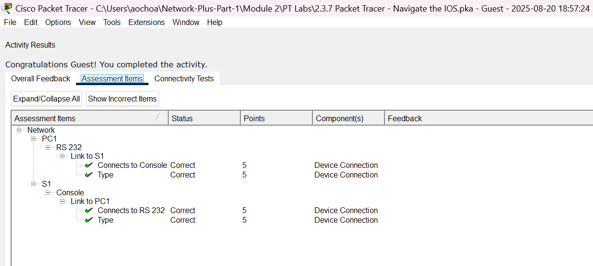
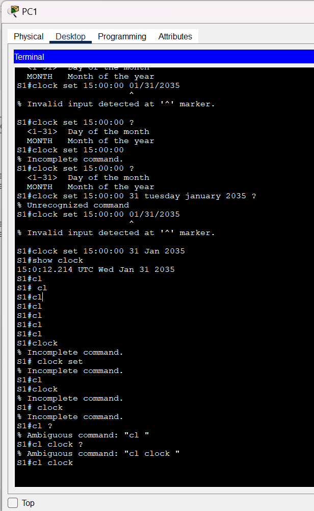

# Packet Tracer Lab Template
## Lab Title
Navigate the IOS

## Student Name
Aida Ochoa

## Date Completed
2025-08-20

---

## Lab Summary

_Provide a brief summary of what the lab was about. What was the goal or objective?_
First I started by conneting the PC with the switch using a console cable. I then went into the terminal.
This lab helped me practice gain some knowledge through accessing the CLI. went through a few commands and short cuts. EXEC modes and set the clock and the date.

---

## Reflection Questions

### 1. What did you do in this lab?
_Describe the steps you took and the tasks you completed._
I  first connected the PC using a console connection. Then accessed the PCs terminal. Pressed "enter" to get started and then followed step by step from the lab.

### 2. What did you learn?
_Explain the concepts or skills you gained from this lab._
I learned that the ? is super helpful when you forget a command, and the Tab key can finish the command for you if you just type part of it.

### 3. What did you struggle with or not fully understand?
_Identify any parts of the lab that were confusing or challenging._
I'm still having trouble remembering the commands, how to use them, and how to type them correctly. But I'm going to keep practicing on my own.

### 4. What suggestions do you have to improve this lab experience?
_Offer feedback on how the lab could be clearer, more engaging, or better supported._
The lab was easy to follow with the step-by-step instructions. It was really informative, and I appreciated the hands-on practice.

---

## Lab Completion Evidence

### 📸 Screenshot: Final Topology

### 📸 Screenshot: Device Configurations
_Insert screenshot(s) showing key device configurations 

### 📸 Screenshot: Simulation Results
_Insert screenshot showing successful pings, traceroutes, or other simulation results_

---

## Submission Instructions

- Fork the lab repo
- Add your answers and screenshots
- Commit with message: `Completed Packet Tracer Lab`
- Push and submit your repo link in the assignment box

---

© 2025 Sean Ross. Template for educational use.
 