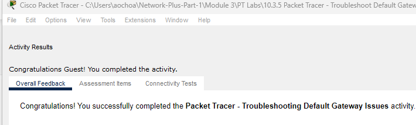
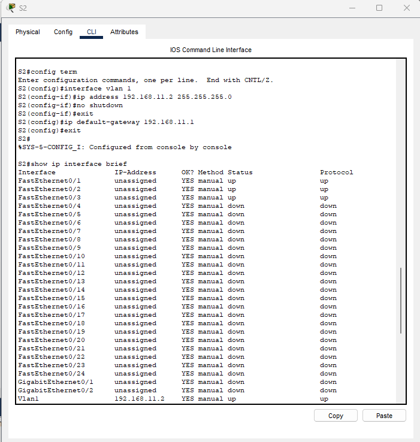
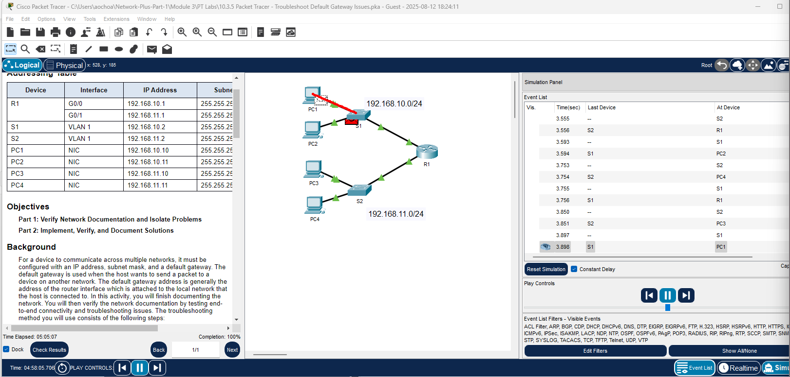

# Packet Tracer Lab Template
## Lab Title
Troubleshoot Default Gateway Issues

## Student Name
Aida Ochoa

## Date Completed
2025-08-27

---

## Lab Summary

_Provide a brief summary of what the lab was about. What was the goal or objective?_
The purpose of this lab is to verify network connectivity by pinging end to end devices and if it does not work, to figure out the problem and implement a solution.
---

## Reflection Questions

### 1. What did you do in this lab?
_Describe the steps you took and the tasks you completed._
In this lab, I tested out the network connection from by pinging PC1 to PC2, PC3, PC4, S1 & R1. Which were all unsuccessful. I checked all the devices networks according to what the addressing table info, and realized the IP address to PC1 was incorrect, PC4 had an incorrect default gateway. After correcting these issues, I pinged the devices again and was succesful until I tested out Switch 2, who did not had the IP address, so I went in through the CLI and configured the IP address. Also discovered the default gateway for Switch 1 was not configured. After doing so, I re-tested the ping connections and everything was successful.

### 2. What did you learn?
_Explain the concepts or skills you gained from this lab._
Testing connectivity and network connections can be tedious but necessary, especially when you do not know what issue you are looking for. Making sure that everything is correct because just a signle digit can cause network issues.

### 3. What did you struggle with or not fully understand?
_Identify any parts of the lab that were confusing or challenging._
I overlooked the Switch configurations a few times, after checking the pings and noticed that they were unsuccessful I had to retrace my steps and thoroughly check that all network configurations and corrected them. So maybe instead of rushing through everything, take the time to look thoroughly the first time.

### 4. What suggestions do you have to improve this lab experience?
_Offer feedback on how the lab could be clearer, more engaging, or better supported._
I have always "enjoyed" the Packet tracer labs, what was different with this one was that when I would go check the results, it would usually give me a list of what was correct and what was missing, it didn't give me that option this time. But that is not a real issue, just something that was different.

---

## Lab Completion Evidence

### 📸 Screenshot: Final Topology

### 📸 Screenshot: Device Configurations

### 📸 Screenshot: Simulation Results

---

## Submission Instructions

- Fork the lab repo
- Add your answers and screenshots
- Commit with message: `Completed Packet Tracer Lab`
- Push and submit your repo link in the assignment box

---

© 2025 Sean Ross. Template for educational use.
 