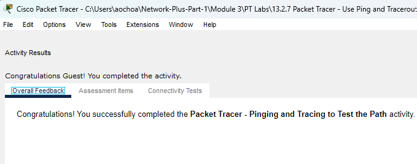
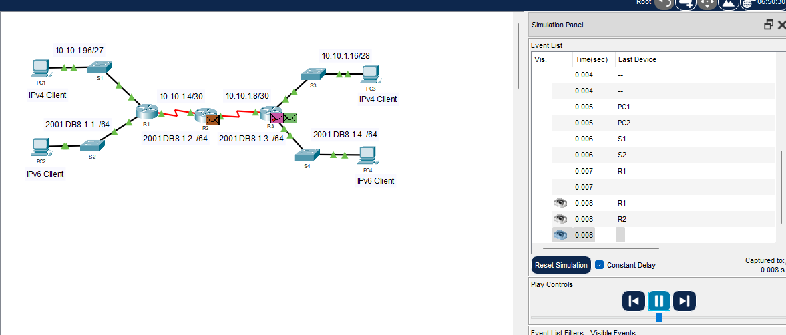
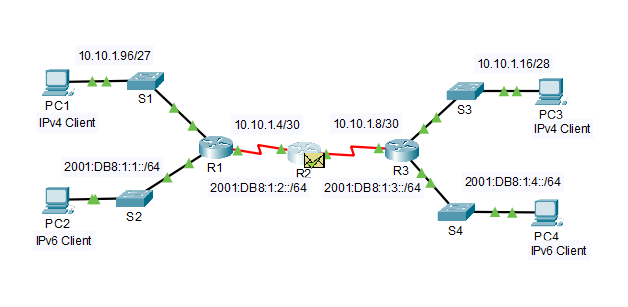

# Packet Tracer Lab Template
## Lab Title
Ping & Traceroute Lab

## Student Name
Aida Ochoa

## Date Completed
2025-08-28

---

## Lab Summary
The purpose of this lab was to test out the ipv4 and ipv6 connections and figure out what the issues were, suggest possible solutions, implement those solutions and test for network connectivity.

---

## Reflection Questions

### 1. What did you do in this lab?
Step by step, I started out by figuring out the IP address, subnet mask and default gateway of PC1. Then of PC3. I then pinged PC1 to PC3 and it was unreachable, 100% loss. In step 2 using tracert to trace route with both PC1 & PC3 ip addresses, I recorded the last successful address reached. Moving on to Router 1, I gathered the IP addresses associated with the router and did the same for Router 2. In doing so, i recorded this information and gathered what could potentially be the source of the connection issue. Router 2had the incorrect IP address. I corrected it to 10.10.1.5. I then tried pinging PC1 and PC3 again, it was successful. On part two, I had to check the connectivity for PC1 and PC4 using ipv6 addresses. Repeating the same steps from part one, pinging PC2 and PC4 which failed. After using tracert to determine that last successful connections. Realizing the default gateway in PC4 was incorrect, once that was updated I pinged PC2 and PC4 again and it was successful. 

### 2. What did you learn?
Throughout this lab I made sure that all networks are within range from eachother in order to get successful connections.

### 3. What did you struggle with or not fully understand?
The lab was pretty staightforward and was easy to understand. The part that I am still learning is the command prompts but I am starting to get the hang of it.

### 4. What suggestions do you have to improve this lab experience?
The lab was pretty easy, the more we do these, the easier they are getting.

---

## Lab Completion Evidence

### 📸 Screenshot: Final Topology

### 📸 Screenshot: Device Configurations

### 📸 Screenshot: Simulation Results

---

## Submission Instructions

- Fork the lab repo
- Add your answers and screenshots
- Commit with message: `Completed Packet Tracer Lab`
- Push and submit your repo link in the assignment box

---

© 2025 Sean Ross. Template for educational use.
 