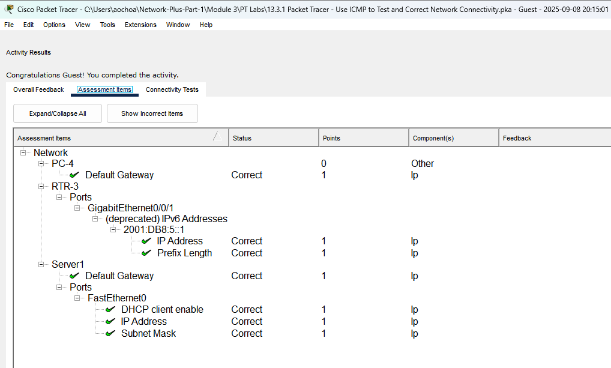
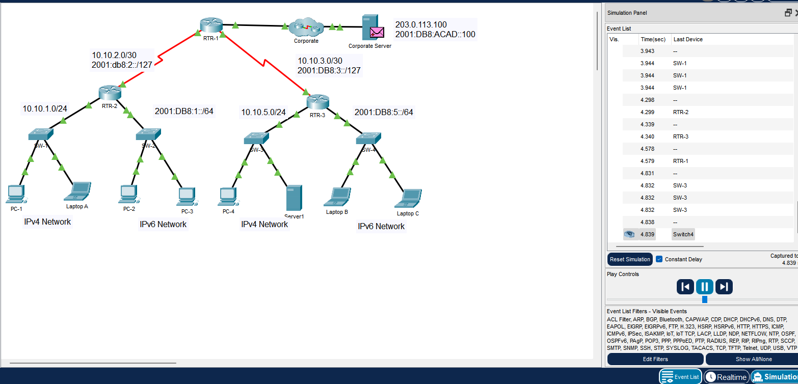
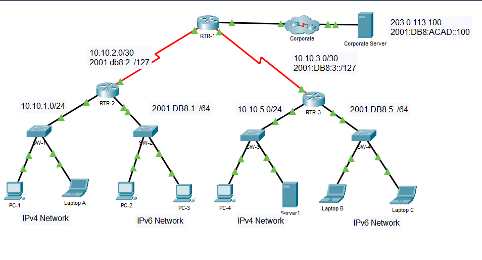

# Packet Tracer Lab Template
## Lab Title
Use ICMP to test and correct network connectivity

## Student Name
Aida Ochoa

## Date Completed
2025-09-09

---

## Lab Summary

The goal of this lab was to be able to use ICMP to determine which device can connect to the other devices in the network. Making sure that all the IP configurations are correct, if not being able to go in and correct them.

---

## Reflection Questions

### 1. What did you do in this lab?
I started by checking the IP configiurations of all the end devices, the PCs, laptops and the server 1. In dping so, I noticed PC4 had an incorrect default gateway of 10.10.5.11 so I corrected it to 10.10.5.1. Server 1 also had incorrect configuration, it was on DHCP so switched it to Static and added the proper IPv4 configurations based on the addressing table. I then checked the 4 Switches and they all seemed to have the correct configurations. Once I got to Router 3, I noticed the G0/0/1 interface was incorrect. Using the CLI I went in and changed it.

### 2. What did you learn?
It is important to have the IP configurations on the devices, even if of by a single digit can throw off the whole network.

### 3. What did you struggle with or not fully understand?
This lab was pretty basic troubleshooting, making sure that all devices are on the correct network with proper configurations.

### 4. What suggestions do you have to improve this lab experience?
I enjoyed this lab, although It looked as though it would be tough, I found it pretty easy.

---

## Lab Completion Evidence

### 📸 Screenshot: Final Topology

### 📸 Screenshot: Device Configurations

### 📸 Screenshot: Simulation Results

---

## Submission Instructions

- Fork the lab repo
- Add your answers and screenshots
- Commit with message: `Completed Packet Tracer Lab`
- Push and submit your repo link in the assignment box

---

© 2025 Sean Ross. Template for educational use.
 