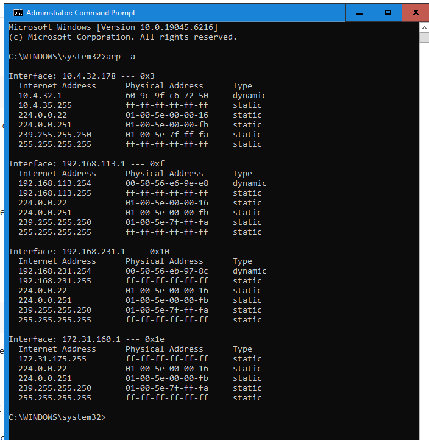
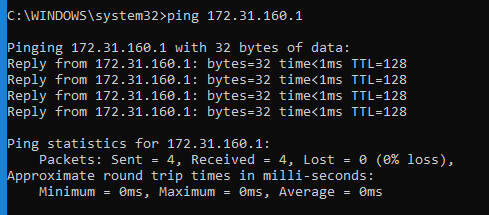
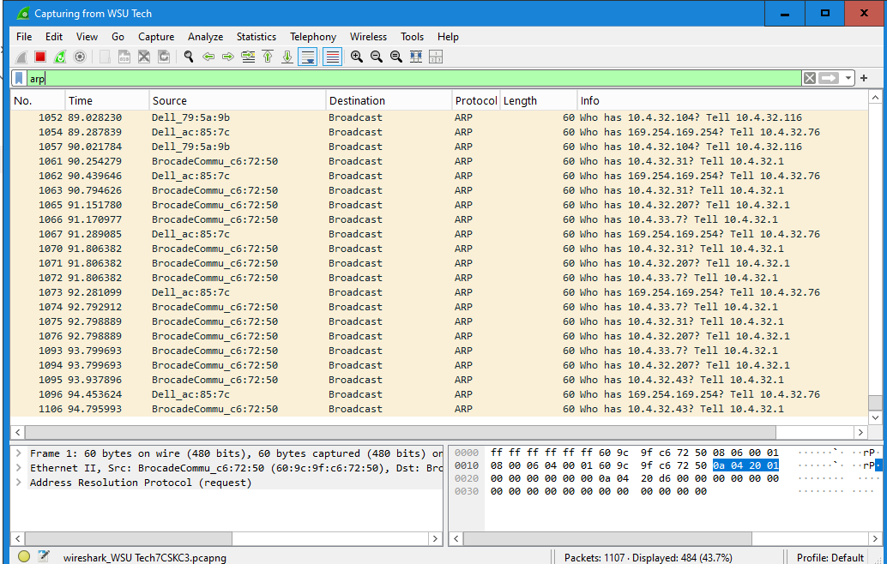

# 🧪 Lab: Investigating the ARP Table and Protocol 

## 🧭 Objective

This lab will guide you through:
- Viewing and understanding the ARP table on a Windows machine.
- Selecting a target device on your home network.
- Clearing the ARP cache.
- Capturing ARP traffic using Wireshark.

---

## 🛠️ Prerequisites

- A Windows PC with administrative privileges.
- Wireshark installed.
- At least one other device connected to the same local network.
- Basic understanding of networking concepts (Layer 2, MAC addresses, IP addresses).

---

## 🔍 Step 1: View the ARP Table
1. Open **Command Prompt** as Administrator.
2. Run the following command:

   ```cmd
   arp -a
   ```
3. Observe the output. You should see a list of IP addresses and their corresponding MAC addresses.



## 🎯 Step 2: Identify a Target Device
1. Choose another device on your network (e.g., phone, tablet, another PC).
2. Find its IP address:
    - On Windows: open CMD and run `ipconfig` 
    - On MAC or Linux: open terminal and run `ip a`
    - On iOS or Android: check Wi-Fi settings 
3. Ping the device from your Windows machine:
    ```CMD
    ping <target IP>
    ```
4. Run the `arp -a` command again to confirm the target device appears in the ARP table



## 🧪 Step 3: Capture ARP Traffic with Wireshark

1. Open Wireshark and start capturing on your active network interface.
2. In the Display Filter, enter: `arp` 
3. Clear the entire ARP cache 
    ```CMD
    netsh interface ip delete arpcache 
    ```
4. Ping target device again 
    ```CMD
    ping <target IP>
    ```
5. Observe ARP request and reply packets in Wireshark 



***

## 🧠 Reflection Questions
1. What does the ARP table tell you about your local network?
The arp table tells me the ip addresses of other devices that are communicating with my local network. The MAC address of the devices network interface. It tells me which network its connected to and what type of entry it is, if it was input manually or dynamic (set automatically). The table can let me know what devices are currently active on my local network.
2. Why might an ARP entry be missing?
An arp table could be missing if the device does not have network connectivity (no wifi) or if the arp cache was recently deleted and has not yet made any new or current connections.
3. What happens when you clear the ARP cache?
Clearing the arp cache disregards any recent connections that have been made/
4. How does Wireshark help visualize Layer 2 communication?
Wireshark gives us a realtime visual of the ip addresses making connections, the source and the destinations of these connections.
