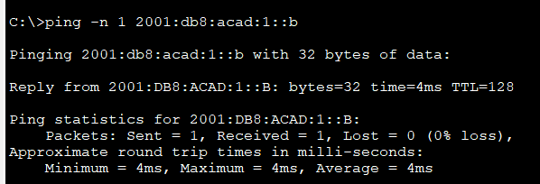
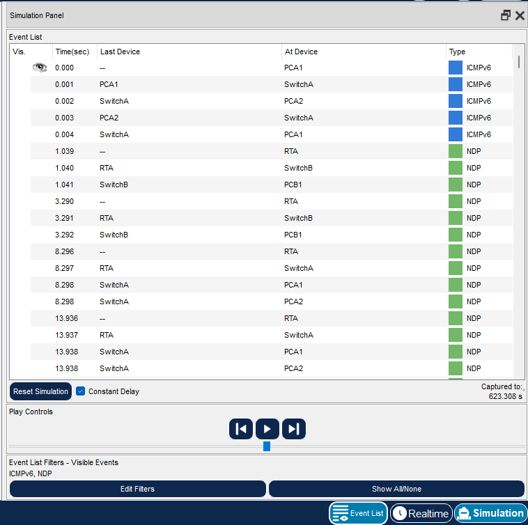

# Packet Tracer Lab Template
## Lab Title
IPv6 Neighbor Discovery

## Student Name
Aida Ochoa

## Date Completed
2025-09-09

---

## Lab Summary

In this lab, the purpose was to understand and manipulate the functions of the IPv6 Neighbor Discovery Protocol (NDP).To see how a device can discover its neighbors MAC addresses.

---

## Reflection Questions

### 1. What did you do in this lab?
I started off by viewing ipv6 neighbors on the router, there were none at the beginning of the lab.
Then, I had to clear the filters for the simulation, through the PCA1 command prompt I pinged -n 1 2001:db8:acad:1::b.
In simulation mode, I watched how devices send messages to find each others addresses and to discover routers on the same network. I also checked to see if the devices could successfully ping eachother.

### 2. What did you learn?
I learned how ipv6 neighbor discovery can help devices that are on the same network find eachother and can communicate automatically. I learned that neighbor discovery is similar to the arp addressing table, it can also check to see what ip addresses are already in use.

### 3. What did you struggle with or not fully understand?
I definitely struggled with understanding the process of neighbor discovery and what exactly it did and how it worked. After a lot of research and reading I started to understand and learn to interpret the messages.

### 4. What suggestions do you have to improve this lab experience?
On this particular lab, I wish I would have had a more step by step guidance on how to interpret the messages during the simulation.

---

## Lab Completion Evidence

### 📸 Screenshot: Device Configurations

### 📸 Screenshot: Simulation Results

---

## Submission Instructions

- Fork the lab repo
- Add your answers and screenshots
- Commit with message: `Completed Packet Tracer Lab`
- Push and submit your repo link in the assignment box

---

© 2025 Sean Ross. Template for educational use.
 