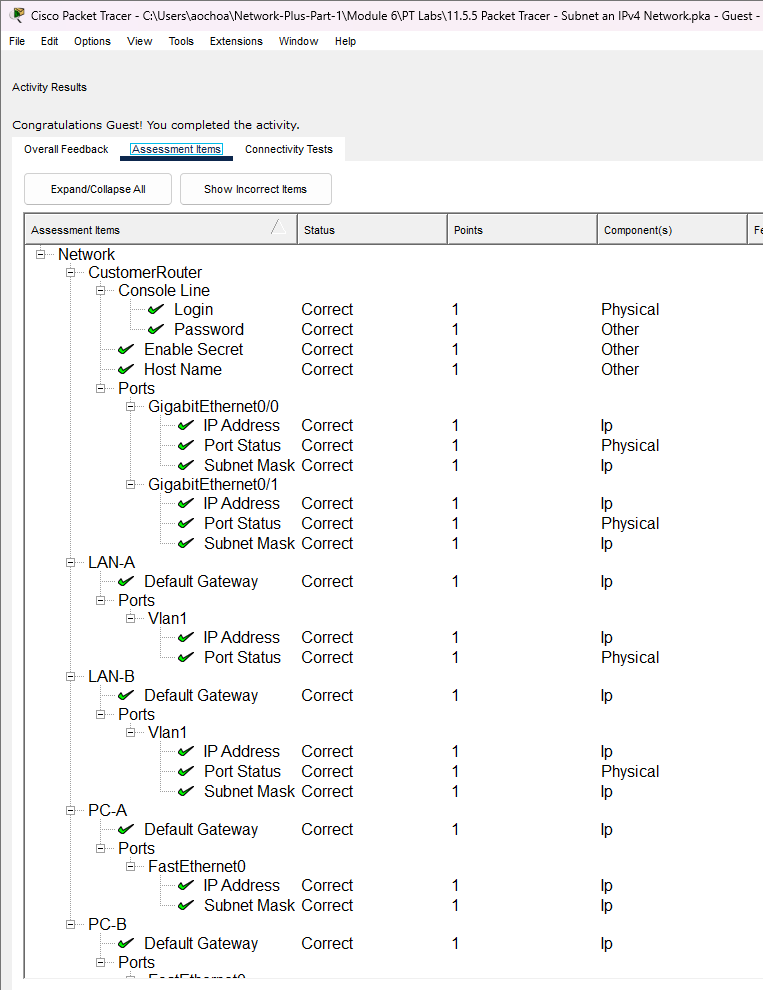
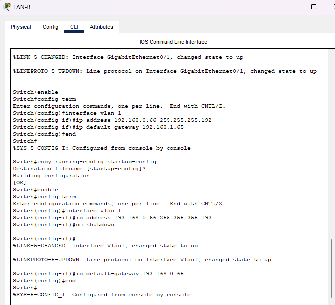
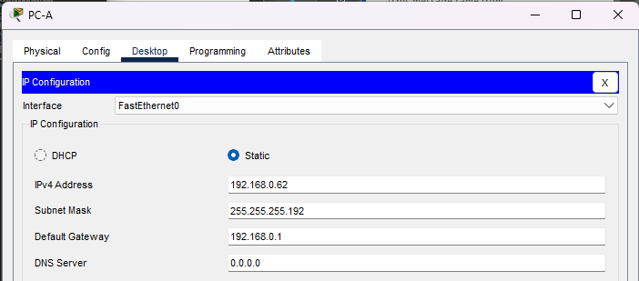
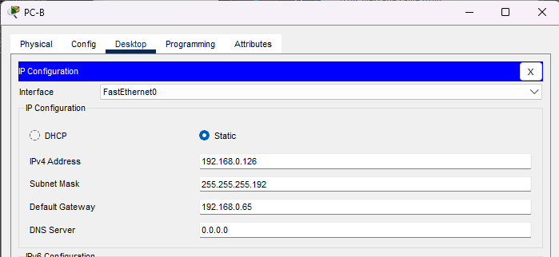
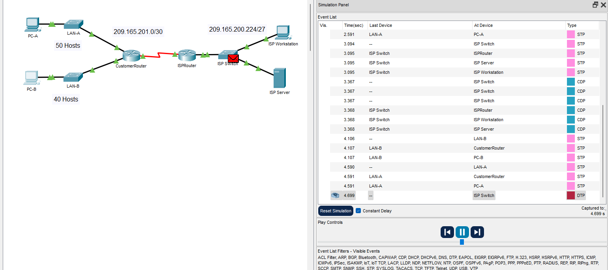

# Packet Tracer Lab Template
## Lab Title
PT Subnet an IPv4 Network
=======

## Student Name
Aida Ochoa

## Date Completed
2025-09-11

---

## Lab Summary

The objective for this lab was to divide a larger network into smaller sub networks. This helps by using only the necessary ip addresses needed to reduce traffic and to simplify the network.

---

## Reflection Questions

### 1. What did you do in this lab?
In this lab, we subnetted an ipv4 network and created smaller sub netowrks based on the host requirements. Had to calculate the subnet masks and assign the ip addresses to the devices. In this lab, the Customer router was configured with the basic configurations. LAN-A, LAN-B, PC-A and PC-B were all configured.

### 2. What did you learn?
In this lab, we learned how to subnet an ipv4 network to efficiently allocate the ip addresses based on the hosts needs. I had some practice on calculating subnet masks, and assigning ip addresses, and configuring network devices. 

### 3. What did you struggle with or not fully understand?
I still struggled a little with figuring out the subnet masks for the hosts. Assigning IP addresses that wouldn't overlap.

### 4. What suggestions do you have to improve this lab experience?
Like the previous labs, if I had more guided step by step instructions. But it was good practice.

---

## Lab Completion Evidence

### 📸 Screenshot: Final Topology

### 📸 Screenshot: Device Configurations
(image-6.png)
(image-7.png)

### 📸 Screenshot: Simulation Results

---

## Submission Instructions

- Fork the lab repo
- Add your answers and screenshots
- Commit with message: `Completed Packet Tracer Lab`
- Push and submit your repo link in the assignment box

---

© 2025 Sean Ross. Template for educational use.
 