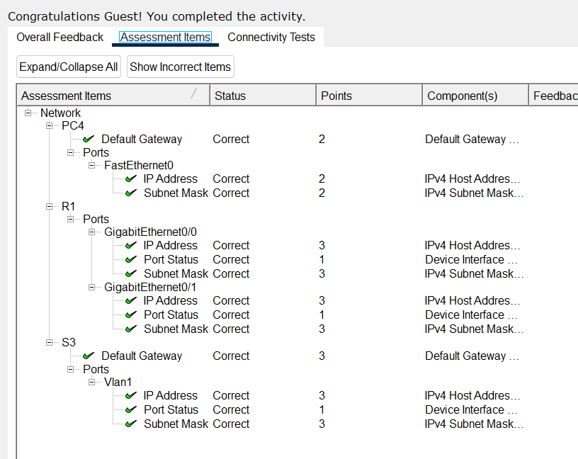
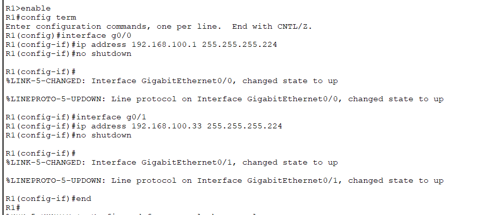
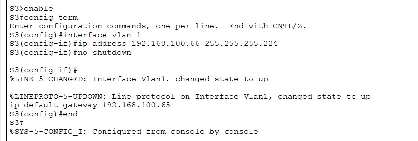
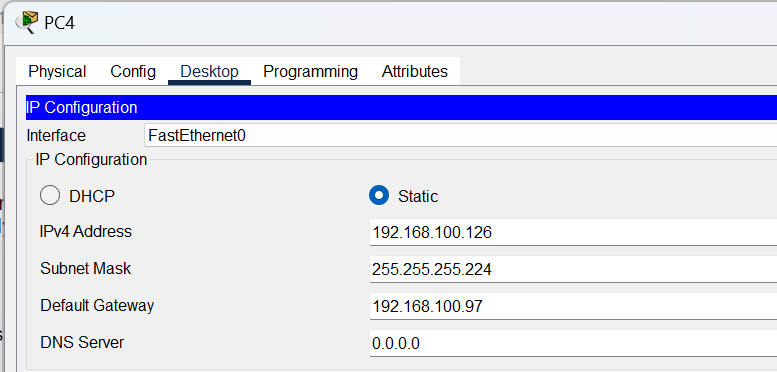
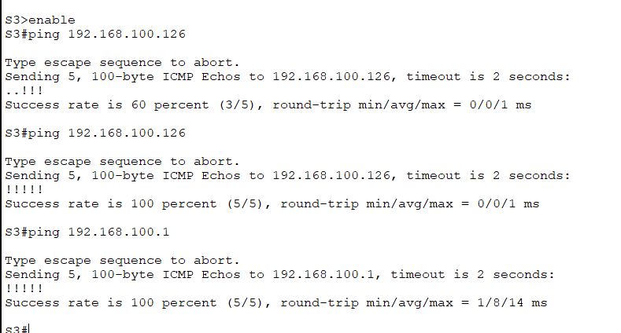

# Packet Tracer Lab Template
## Lab Title
Subnetting Scenario

## Student Name
Aida Ochoa

## Date Completed
2025-09-25

---

## Lab Summary

The objective of this lab was to practice dividing a large network into smaller subnets based on the requirements for each device.

---

## Reflection Questions

### 1. What did you do in this lab?
I first started by creating the addressing table based on the hosts needed for each device. I then went and cofigured the devices with the ip addresses, subnet masks and default gateways.

### 2. What did you learn?
I got some more practice on subnetting based on the specific requirements. How to assign the ip addresses correctly on the router, switch and pcs.

### 3. What did you struggle with or not fully understand?
Subnetting took the longest, breaking it down and configuring the addressing table but I believe its starting to get easier.

### 4. What suggestions do you have to improve this lab experience?
I enjoyed the lab, it was good practice. I did not struggle with any of the information provided.

---

## Lab Completion Evidence

### 📸 Screenshot: Final Topology

### 📸 Screenshot: Device Configurations

### 📸 Screenshot: Simulation Results

---

## Submission Instructions

- Fork the lab repo
- Add your answers and screenshots
- Commit with message: `Completed Packet Tracer Lab`
- Push and submit your repo link in the assignment box

---

© 2025 Sean Ross. Template for educational use.
 