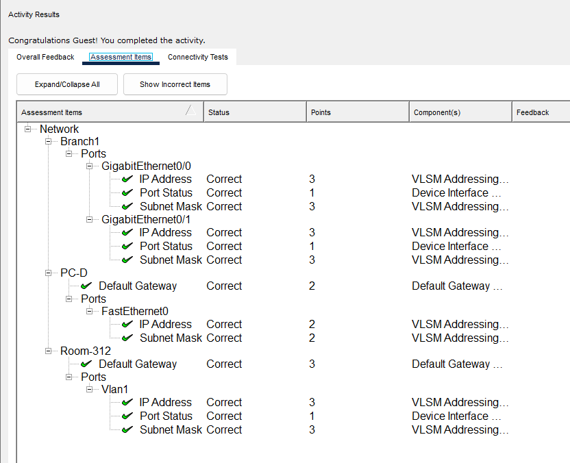
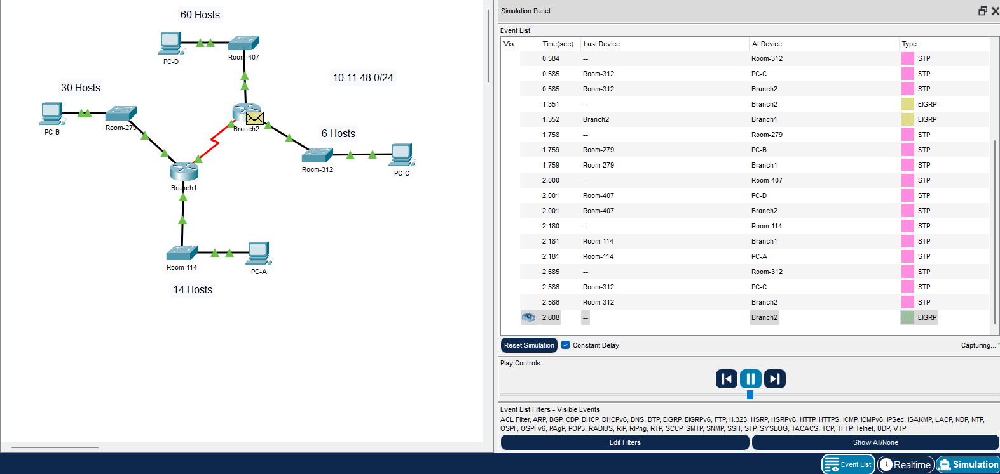

# Packet Tracer Lab Template
## Lab Title
VLSM Design and Implementation Practice
## Student Name
Aida Ochoa

## Date Completed
2025-09-23

---

## Lab Summary

The objective of this lab was to learn how to create and implement an efficient ip addressing scheme using vlsm.
---

## Reflection Questions

### 1. What did you do in this lab?
After creating the subnets needed for each branch, room and PC I then went to configure the devices. The devices needed to configure were the Router Branch 1, Switch Room 312 and PC-D. The others were locked by authors design.

### 2. What did you learn?
In this lab, I learned how to design and implement ip addresses using vlsm to fit the number of ddevices in ech network.

### 3. What did you struggle with or not fully understand?
I struggled with figuring out the right subnet sizes for each network and making sure the ip addresses didn't overlap. I also forgot to enable the switch using the "no shutdown" command which caused a delay and potential connectivity issues.

### 4. What suggestions do you have to improve this lab experience?
I really struggled with knowing how to create the subnets, I know I need a lot more practice but a more guided step by step would have been helpful for me.

---

## Lab Completion Evidence

### 📸 Screenshot: Final Topology

### 📸 Screenshot: Device Configurations

### 📸 Screenshot: Simulation Results

---

## Submission Instructions

- Fork the lab repo
- Add your answers and screenshots
- Commit with message: `Completed Packet Tracer Lab`
- Push and submit your repo link in the assignment box

---

© 2025 Sean Ross. Template for educational use.
 