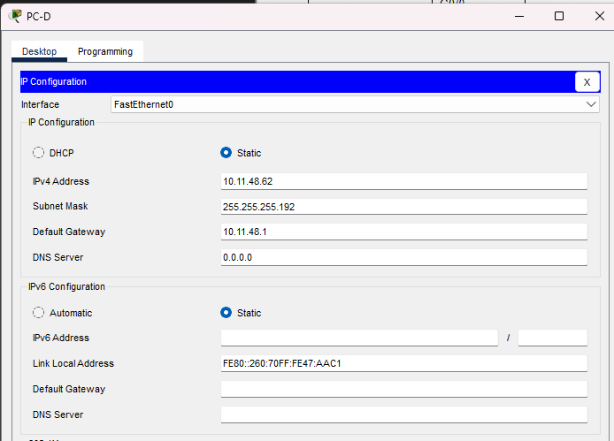
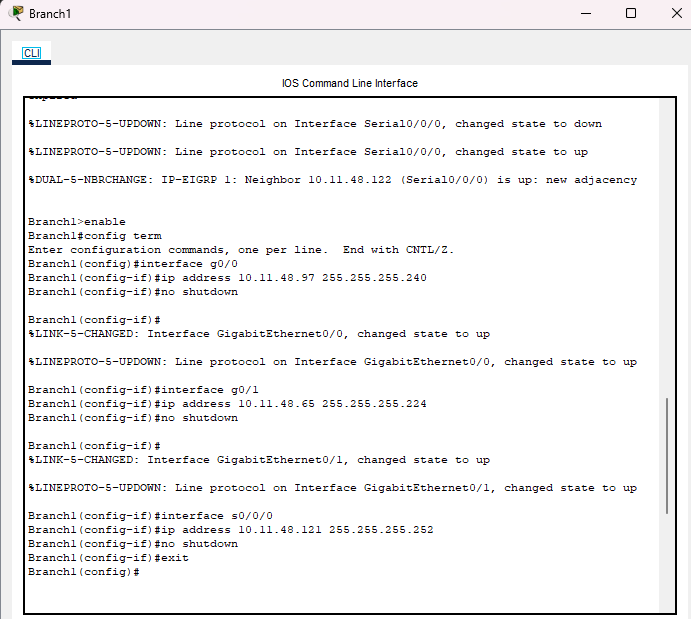
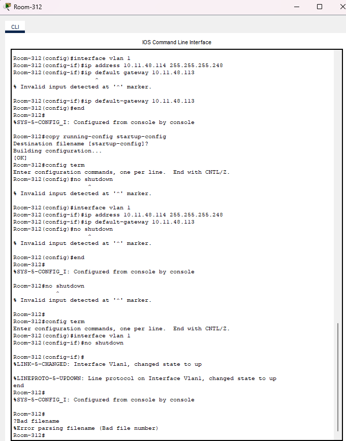

# Packet Tracer Lab Template
## Lab Title
Implement a Subnetted IPv6 Addressing Scheme

## Student Name
Aida Ochoa

## Date Completed
2025-09-20  

---

## Lab Summary

The objective of this lab was to configure an ipv6 addressing scheme for the routers using the ipv6 given 2001:db8:acad:00c8::1/64 by breaking it down into smaller subnets. Then making sure the PCs could ping eachother successfully.

---

## Reflection Questions

### 1. What did you do in this lab?
In this lab, I used the IPv6 address given and broke it down into the different devices in the network. Using the address given, i just made sure to keep it in the same network. I did this through the Router CLI commands. I then went and made sure the PCs would automatically configure an ipv6 address and made to sure to ping another PC successfully in order to confirm that the routers had been configured correctly.

### 2. What did you learn?
I learned how to configure an ipv6 addressing scheme by breaking down the address into smaller portions and configuring it on the router.

### 3. What did you struggle with or not fully understand?
I struggled a little with how to efficiently break down and divide the ipv6 addresses into the right subnet and making sure I was assigning them correctly.

### 4. What suggestions do you have to improve this lab experience?
It would have been a little clearer if I would have had an example of how to divide and assign subnets. But it was okay, I had to do a little research on how to configure so it wasn't too bad.

---

## Lab Completion Evidence

### 📸 Screenshot: Final Topology

### 📸 Screenshot: Device Configurations

### 📸 Screenshot: Simulation Results

---

## Submission Instructions

- Fork the lab repo
- Add your answers and screenshots
- Commit with message: `Completed Packet Tracer Lab`
- Push and submit your repo link in the assignment box

---

© 2025 Sean Ross. Template for educational use.
 