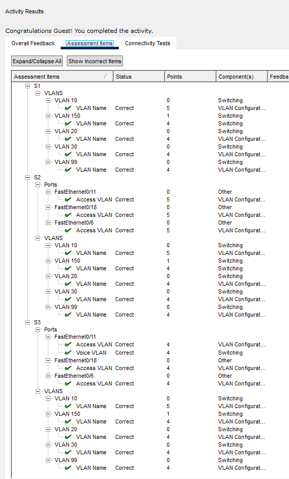
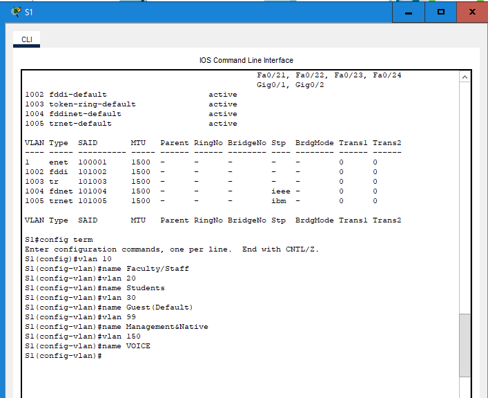
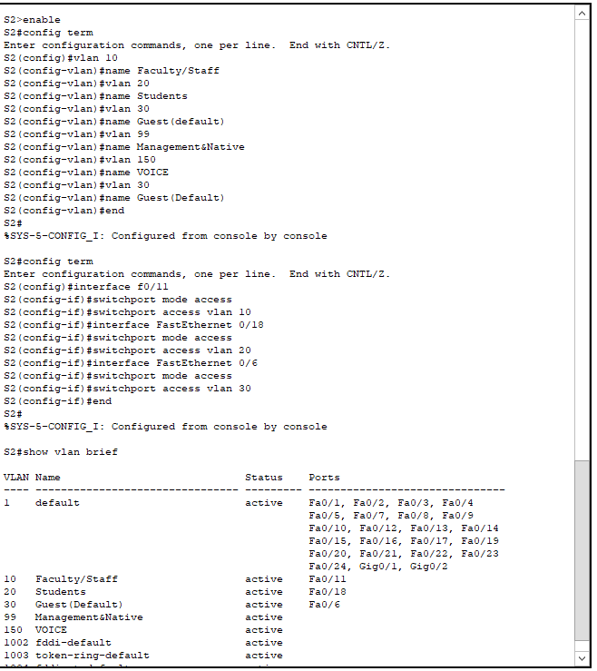
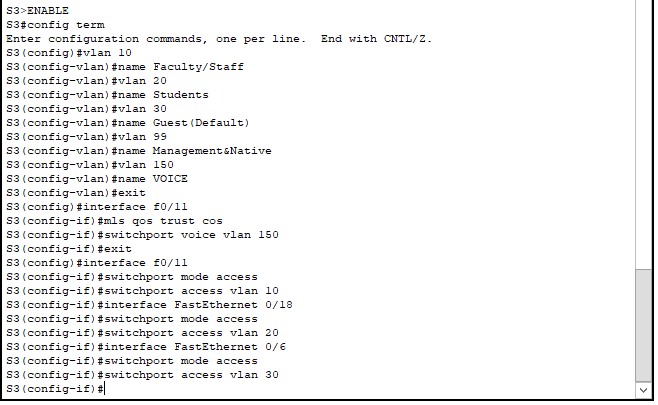
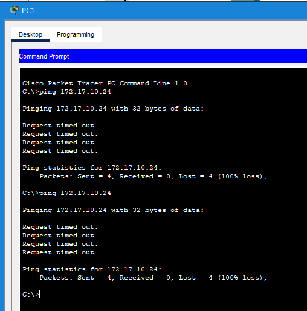

# Packet Tracer Lab Template
## Lab Title
VLAN Configuration
## Student Name
Aida Ochoa

## Date Completed
2025-09-30

---

## Lab Summary

The objective of this lab is to create and name the vlans, and to assign access ports to specific vlans.

---

## Reflection Questions

### 1. What did you do in this lab?
I created vlans in Switch 1, Switch 2 and switch 3 and named them. I then assigned vlans to ports on switch 2 and switch 3.

### 2. What did you learn?
The last pinging failed because the switches were on vlan 1 while the pcs were on vlan 10. VLANs seperated the traffic after being created.

### 3. What did you struggle with or not fully understand?
This lab was pretty simple and straightforward

### 4. What suggestions do you have to improve this lab experience?
This lab was pretty easy to follow and understand.

---

## Lab Completion Evidence

### 📸 Screenshot: Final Topology

### 📸 Screenshot: Device Configurations

### 📸 Screenshot: Simulation Results

---

## Submission Instructions

- Fork the lab repo
- Add your answers and screenshots
- Commit with message: `Completed Packet Tracer Lab`
- Push and submit your repo link in the assignment box

---

© 2025 Sean Ross. Template for educational use.
 