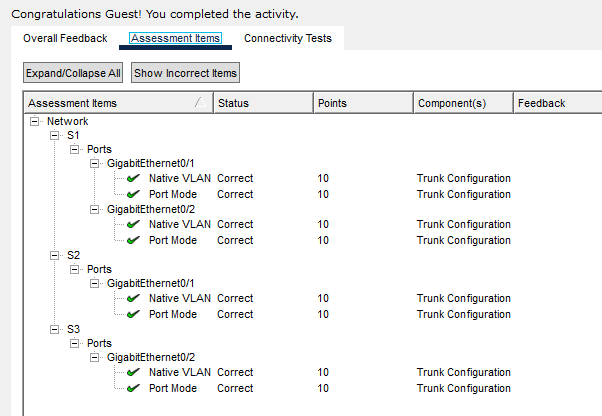
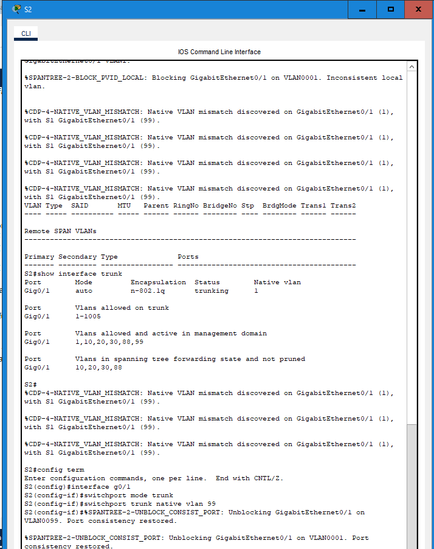
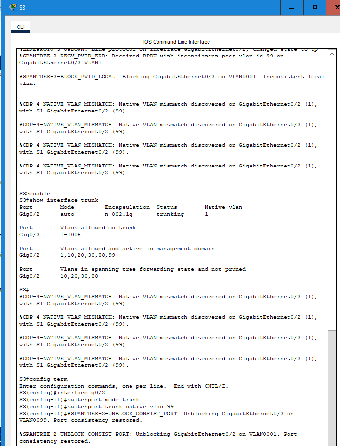
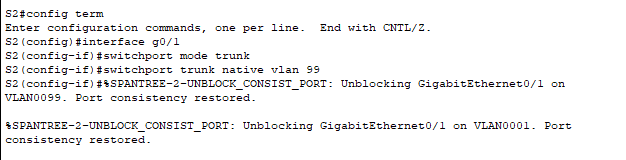

# Packet Tracer Lab Template
## Lab Title
Configure Trunks
## Student Name
Aida Ochoa
## Date Completed
2025-09-30

---

## Lab Summary

The objective of this lab was to learn how to connect switches using trunk ports so that the vlans can communcate across multiple switches.

---

## Reflection Questions

### 1. What did you do in this lab?
In this lab, I verified the vlans on the switches and configured the trunks on switch 2 and switch 3

### 2. What did you learn?
I learned that once you trunk an interface, it no longer shows on the vlan because its job now is to carry traffic to multiple vlans not just one.

### 3. What did you struggle with or not fully understand?
I understand the concept of why we need to trunk, I am still trying to learn how to properly set those configurations.

### 4. What suggestions do you have to improve this lab experience?
The lab was easy to follow and good practice in trunking.

---

## Lab Completion Evidence

### 📸 Screenshot: Final Topology

### 📸 Screenshot: Device Configurations

### 📸 Screenshot: Simulation Results

---

## Submission Instructions

- Fork the lab repo
- Add your answers and screenshots
- Commit with message: `Completed Packet Tracer Lab`
- Push and submit your repo link in the assignment box

---

© 2025 Sean Ross. Template for educational use.
 