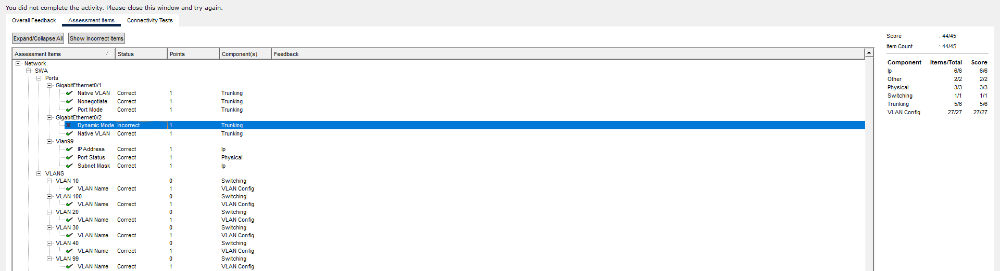
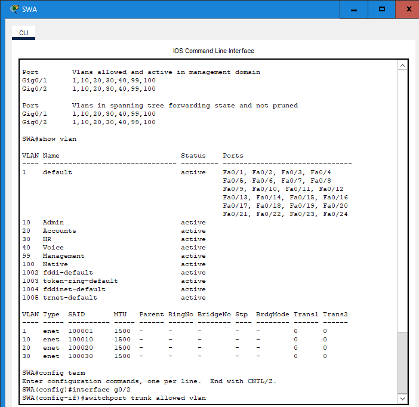
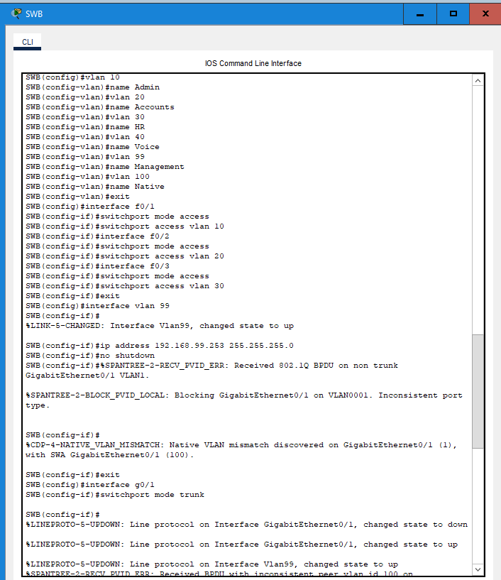
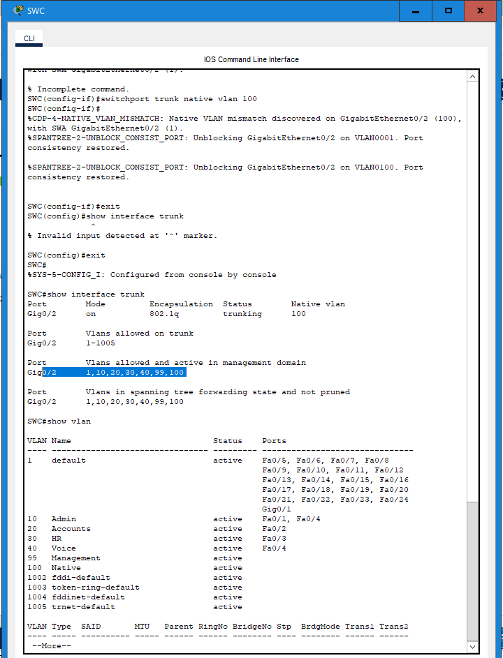

# Packet Tracer Lab Template
## Lab Title
Implement VLANs and Trunking
## Student Name
Aida Ochoa

## Date Completed
09-30-2025

---

## Lab Summary

The objective of this lab was to be able to configure the vlans, assign the ports to to the vlans. COnfigure the static trunking and configure dynamic trunking which did not work so well in this lab.

---

## Reflection Questions

### 1. What did you do in this lab?
In this lab i configured switch A, switch b and switch c. I created vlans and named them based on the addressing table.

### 2. What did you learn?
In this lab i learned a few new commands such as "switchport mode dynamic desirable" which makes the interface actively attempt to convert the link to a trunk link. The "switchport nonegotiate" which prevemts the interface from generating dtp frames.

### 3. What did you struggle with or not fully understand?
The commands needed to complete the assignment, the nonegotiate command took a little bit of reading to see what it was and how it was intended to use.

### 4. What suggestions do you have to improve this lab experience?
The dynamic desirable part of the lab did not function, leaving my lab at 97% completed.
---

## Lab Completion Evidence

### 📸 Screenshot: Final Topology

### 📸 Screenshot: Device Configurations

---

## Submission Instructions

- Fork the lab repo
- Add your answers and screenshots
- Commit with message: `Completed Packet Tracer Lab`
- Push and submit your repo link in the assignment box

---

© 2025 Sean Ross. Template for educational use.
 