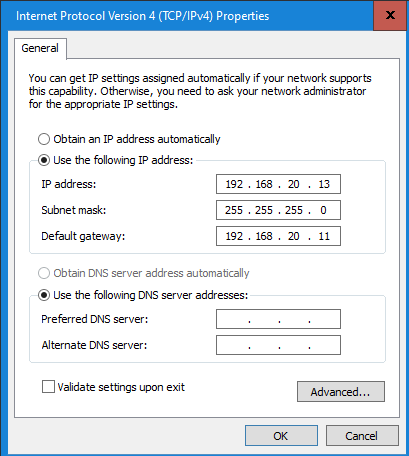
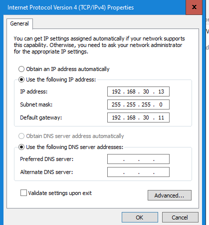
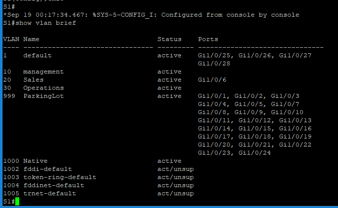
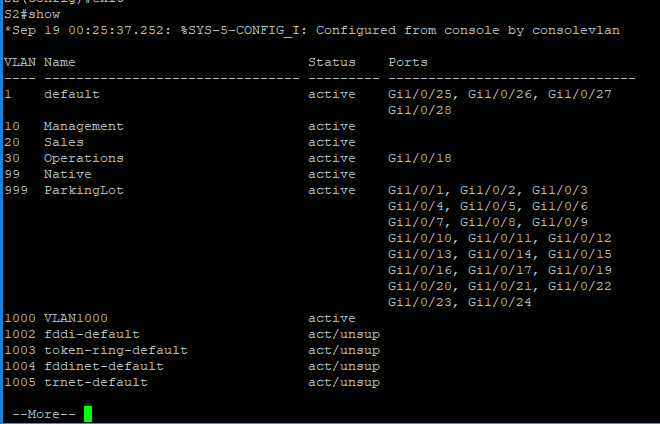
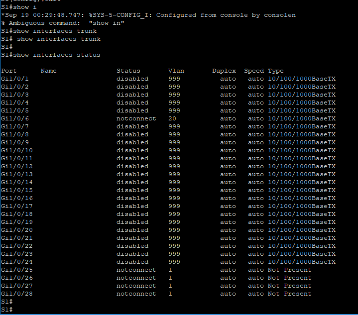

# 3.6.2 Lab - Implement VLANs and Trunking

## Topology & Addressing Table

| Device | Interface | IP Address       | Subnet Mask     |
|--------|-----------|------------------|------------------|
| S1     | VLAN 10   | 192.168.10.11    | 255.255.255.0    |
|        | VLAN 20   | 192.168.20.11    | 255.255.255.0    |
|        | VLAN 30   | 192.168.30.11    | 255.255.255.0    |
| S2     | VLAN 10   | 192.168.10.12    | 255.255.255.0    |
| PC-A   | NIC       | 192.168.20.13    | 255.255.255.0    |
| PC-B   | NIC       | 192.168.30.13    | 255.255.255.0    |

---

## VLAN Table

| VLAN  | Name        | Interface Assigned                          |
|-------|-------------|---------------------------------------------|
| 10    | Management  | S1: VLAN 10, S2: VLAN 10                    |
| 20    | Sales       | S1: VLAN 20 and F0/6                        |
| 30    | Operations  | S1: VLAN 30, S2: F0/18                      |
| 999   | ParkingLot  | S1: F0/2–5, F0/7–24, G0/1–2; S2: F0/2–17, F0/19–24, G0/1–2 |
| 1000  | Native      | N/A                                         |

---

## Objectives

- **Part 1:** Build the Network and Configure Basic Device Settings  
- **Part 2:** Create VLANs and Assign Switch Ports  
- **Part 3:** Configure an 802.1Q Trunk between the Switches

---

## Part 1: Build the Network and Configure Basic Device Settings

### Step 1: Cable the network as shown in the topology

---

### Step 2: Configure basic settings for each switch

1. Console into the switch and enable privileged EXEC mode  
2. Assign a device name  
3. Disable DNS lookup  
4. Set encrypted privileged EXEC password: `class`  
5. Set console and VTY passwords: `cisco`  
6. Encrypt plaintext passwords  
7. Create a login banner  
8. Save the configuration  

---

### Step 3: Configure PC hosts

- Refer to the Addressing Table for IP configuration  
**Screenshot Placeholder:**  

---

## Part 2: Create VLANs and Assign Switch Ports

### Step 1: Create VLANs on both switches

1. Create and name VLANs from the VLAN Table  
2. Configure management interface with IP address  
3. Assign unused ports to VLAN 999 (ParkingLot), set to static access mode, and shut them down  

---

### Step 2: Assign VLANs to the correct switch interfaces

1. Assign used ports to appropriate VLANs  
2. Configure static access mode  
3. Verify VLAN assignments using `show vlan brief`  

---

## Part 3: Configure an 802.1Q Trunk Between the Switches

### Step 1: Manually configure trunk interface F0/1

1. Set `switchport mode trunk` on F0/1 (both switches)  
2. Set native VLAN to 1000  
3. Allow VLANs 10, 20, 30, and 1000 on the trunk  
4. Verify trunking with `show interfaces trunk`  

---

### Step 2: Verify connectivity

- **Can PC-A ping S1 VLAN 20?**  
  _Answer:_  No

- **Were the pings from PC-B to S2 successful? Explain.**  
  _Answer:_  No, the pings were not successful because they are on seperate vlans.

---

## Reflection

**Why is trunking important for VLAN communication across switches? What issues might arise if trunking is misconfigured?**  
_Answer:_  Trunking is important in order to carry muliple vlans over a single physical link. Trunking allows more than a single vlan to communicate throughout an entire network between switches. It allows devices on the same vlan to communicate even if they are on seperate switches. If trunking is not configured correctly the link wont form and the connection will be lost. Without trunking, we would need cables running through each switch we'd want to communicate with.
