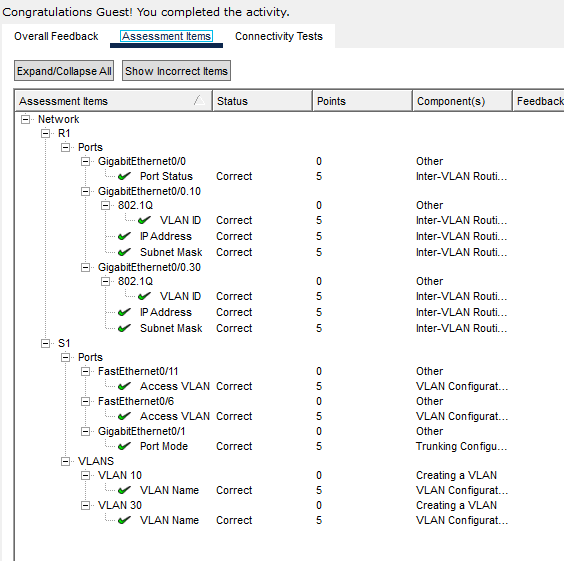
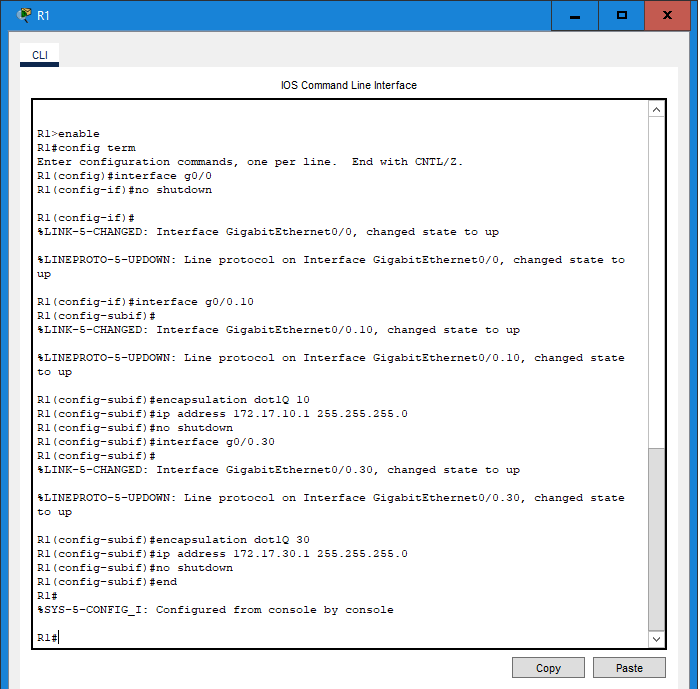
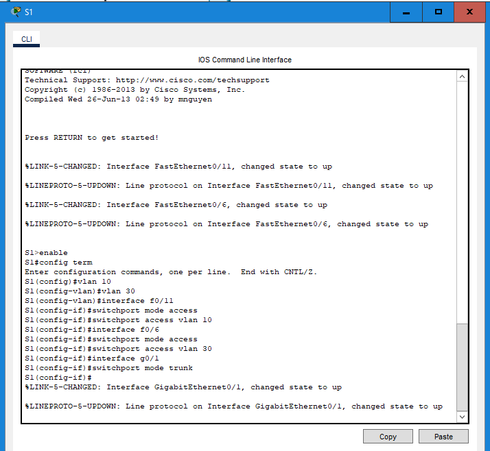

# Packet Tracer Lab Template
## Lab Title
Configure router on a stick inter-vlan routing

## Student Name
Aida Ochoa

## Date Completed
2025-09-25

---

## Lab Summary

The objective to this lab is to be able to add vlans to the switch and configure the subinterfaces & test their connectivity.

---

## Reflection Questions

### 1. What did you do in this lab?
In this lab, I added vlans 10 & 30 to the switch. I created a subinterface g0/0.10 and g0/0.30. Following the steps, I used the encapsulation dot1q command and assigned the ip address for both subinterfaces.

### 2. What did you learn?
I learned that by encapsulating an subinterface, this allows for specific traffic to be processed by specifying the layer 2 trunking protocol. This allows the router port to act as multiple logical interfaces and each subinterface handles a specific vlan. This lets routing occur between different subnets on a single link.

### 3. What did you struggle with or not fully understand?
I struggled with the commands on the encapsulation and understanding what they meant and what they did in this assignment.
### 4. What suggestions do you have to improve this lab experience?
This lab was very informative, I learned breifly some new commands and what they do. It was definitely good practice.

---

## Lab Completion Evidence

### 📸 Screenshot: Final Topology

### 📸 Screenshot: Device Configurations

### 📸 Screenshot: Simulation Results
_Insert screenshot showing successful pings, traceroutes, or other simulation results_

---

## Submission Instructions

- Fork the lab repo
- Add your answers and screenshots
- Commit with message: `Completed Packet Tracer Lab`
- Push and submit your repo link in the assignment box

---

© 2025 Sean Ross. Template for educational use.
 