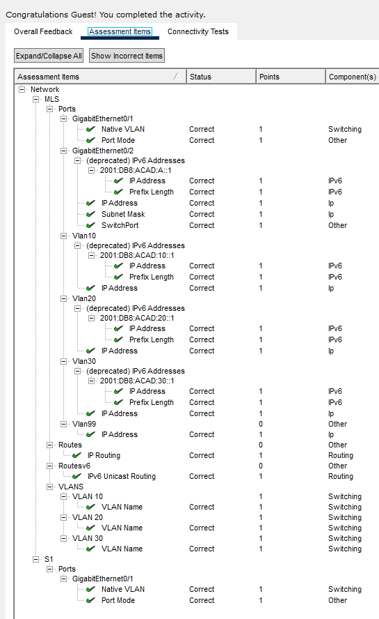
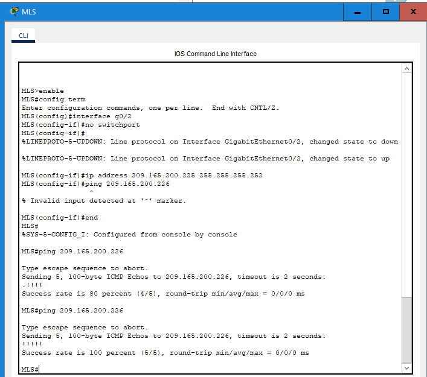
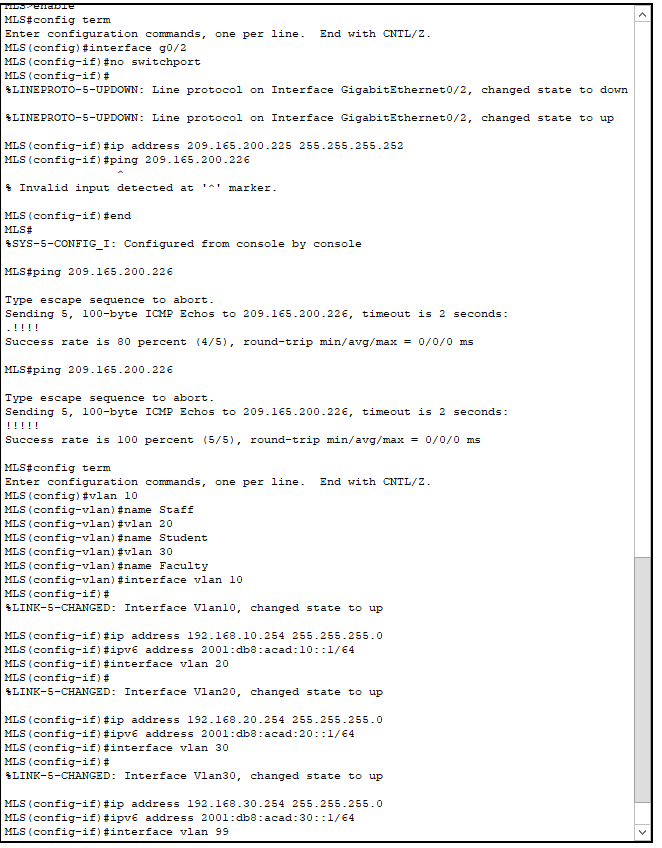
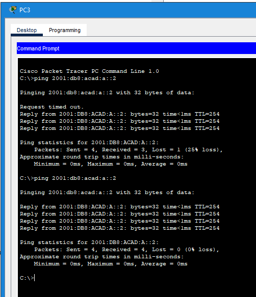

# Packet Tracer Lab Template
## Lab Title
Configure layer 3 switching and inter vlan routing 

## Student Name
Aida Ochoa

## Date Completed
2025-09-25

---

## Lab Summary

The objective of this lab was to configure layer 3 switching, configure the inter-vlan routing adn ipv6 inter-vlan routing based on the address table provided. This enables the communication between the different vlans by having a layer 3 switch doing the routing.

---

## Reflection Questions

### 1. What did you do in this lab?
In this lab, I followed the step by step configurations for each device, starting with the MLS. Adding and naming the VLANs and configured the ip and ipv6 addresses. Used the switchport mode trunk to convert the interface into a trunk port. Enabled the routing and verified through the show ip route command. I tested out the connectivity between the different VLANs by pinging PCs on their specific VLAN.

### 2. What did you learn?
I learned how to enable the communication between different VLANs using a layer 3 switch. I learned that a layer 3 switch can route traffic between VLANs using SVIs.

### 3. What did you struggle with or not fully understand?
The specific commands for each task is still a bit frustrating, fully understanding when to use each command and what it does to help complete the assigned tasks.

### 4. What suggestions do you have to improve this lab experience?
This lab was very helpful, the instructions were clear and easy to follow. 

---

## Lab Completion Evidence

### 📸 Screenshot: Final Topology

### 📸 Screenshot: Device Configurations

### 📸 Screenshot: Simulation Results

---

## Submission Instructions

- Fork the lab repo
- Add your answers and screenshots
- Commit with message: `Completed Packet Tracer Lab`
- Push and submit your repo link in the assignment box

---

© 2025 Sean Ross. Template for educational use.
 