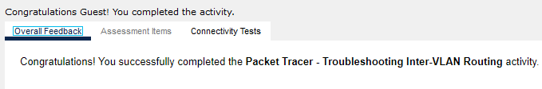
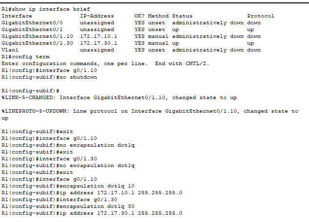
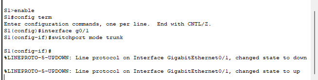
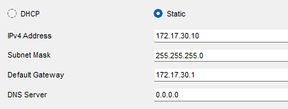

# Packet Tracer Lab Template
## Lab Title
Toubleshooting Inter-Vlan Routing

## Student Name
Aida Ochoa

## Date Completed
2025-10-01

---

## Lab Summary

The objective of this lab was to troubleshoot the connectivity and identify what is causing the issue and then administer the correct commands to correct the issue.

---

## Reflection Questions

### 1. What did you do in this lab?
In this lab I verified the connectivity starting with the router using the show ip interface brief command. I noticed that the subinterface was down so I had to administer the "no shutdown command to enable it. On the switch, i had to change the interface access mode to trunk mode an i had to issue the encapsulation do1q on vlan 10 and 30 along with the correct ip addresses based on the addressing table. The last thing I had to correct was the default gateway on PC3.

### 2. What did you learn?
I learned the command on how to remove an incorrect configuration on a subinterface vlan using "no encapsulation dot1q"

### 3. What did you struggle with or not fully understand?
I didn't understand how to remove the configuration, after reading a lttle bit about it, it started to make sense.

### 4. What suggestions do you have to improve this lab experience?
Great practice, no complaints on this assignment.

---

## Lab Completion Evidence

### 📸 Screenshot: Final Topology

### 📸 Screenshot: Device Configurations

---

## Submission Instructions

- Fork the lab repo
- Add your answers and screenshots
- Commit with message: `Completed Packet Tracer Lab`
- Push and submit your repo link in the assignment box

---

© 2025 Sean Ross. Template for educational use.
 