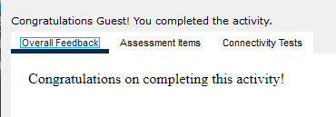
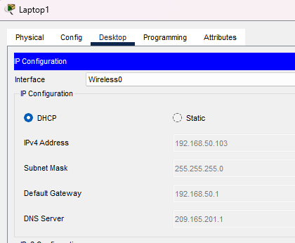
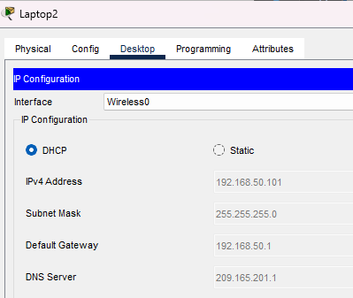
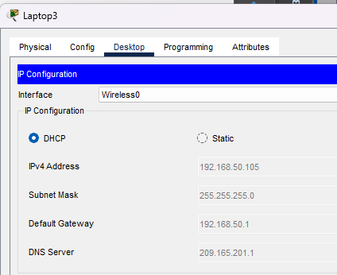
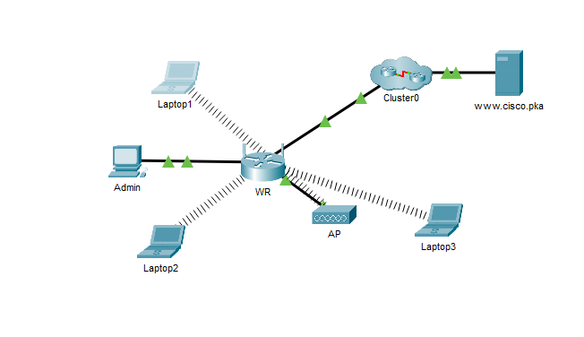

# Packet Tracer Lab Template
## Lab Title
Configure a Wireless Network
## Student Name
Aida Ochoa

## Date Completed
2025-10-01

---

## Lab Summary

The objective on this lab was to connect a wireless router to wireless devices,configure the wireless router. Connect a device with a wired cable. Added an access point to the networks to extend the wireless coverage and then updated the routers.

---

## Reflection Questions

### 1. What did you do in this lab?
In this lab, I connected the Admin computer to the Wireless router using a straight through cable. Through the admin computers web browse I configured the basic setup settings based on the assignment. Then verified that I could navigate to www.cisco.pka. I then went and configured the laptops for wireless connection. Configured the routers SSID and security settings.

### 2. What did you learn?
I learned how to configure the wireless settings on the router using the web browser from the Admin computer.

### 3. What did you struggle with or not fully understand?
This lab was easy to understand and follow through.

### 4. What suggestions do you have to improve this lab experience?
This lab was good, nothing to improve.

---

## Lab Completion Evidence

### 📸 Screenshot: Final Topology

### 📸 Screenshot: Device Configurations

### 📸 Screenshot: Simulation Results

---

## Submission Instructions

- Fork the lab repo
- Add your answers and screenshots
- Commit with message: `Completed Packet Tracer Lab`
- Push and submit your repo link in the assignment box

---

© 2025 Sean Ross. Template for educational use.
 